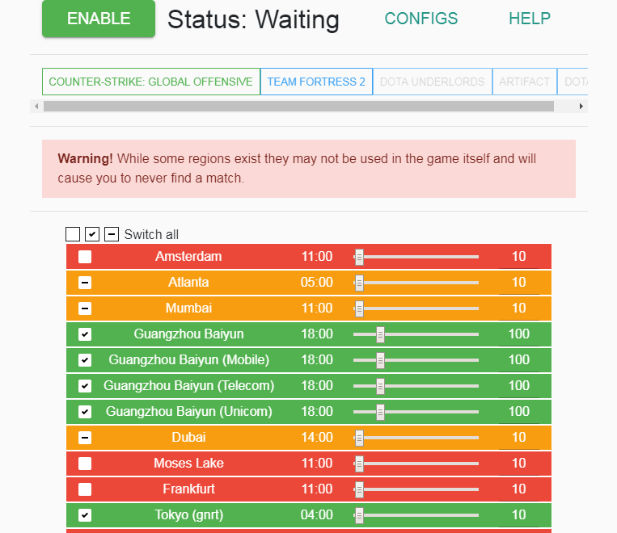

# Region Selector

Allows you to select what servers to connect to in the following games: `Team Fortress 2` and `Counter-Strike: Global Offensive`

In the future I will maybe add support for more games if requested.

---

# Installation

1. Download the latest version from the `Releases` section
   - On Windows download: `Valve.Region.Selector.Setup.<version>.exe`
   - On Linux download: `Valve.Region.Selector-<version>.AppImage`
     - Note: Most of these instructions are related to Windows only but if you are using Linux you should know how it works.
2. Install the program
3. It should now automatically open, if not run the created `Valve Region Selector.exe` on your desktop

# Previews

# Questions

- Can I get banned for this?
  - Technically anything could get you banned and things could change whenever Valve wants to. This program **does not** modify the game nor VAC. It intercepts all Steam traffic and modifies only one specific packet which tells the matchmaker what ping you have to different regions. Everything else stays untouched.

- How do I update?
  - Uninstall the old version, go to Github and download the new version.

- How do I uninstall?
  - Right click on the shortcut which was created on your desktop during installation, click on `Open file location` and open the uninstaller.

- What do the checkboxes mean?
  - A legend on what each color means is available in the help section.

- Can I close the program after enabling it?
  - No. The program is keeping Steam running, if you close it Steam will close too.

- Do I have to restart every time I change the ping settings?
  - No. You can change your ping settings whenever you want. Some games may update instantly, some may not. Team Fortress 2 for example only updates pings every ~3 minutes so you may have to wait before your changes apply.

- Why not just use a VPN?
  - Steam disallows the usage of VPNs though I don't think they ban for it unless you use it to excessively buy games for cheaper. This program does not let you buy game for cheaper and does not change your IP. *Also not everyone has a VPN.*

- You made typos in the regions!
  - These regions are directly ripped from Valve, all complains about typos regarding the regions go to Valve.

# Credit

Thanks for testing and feedback:
- [Neonx99](https://github.com/Neonx99)
- [Invades](https://github.com/Invades)
- AutismWell

Made possible in-part by:
- [NodeJS](https://nodejs.org/)
- [ElectronJS](https://electronjs.org/)
- [World Time API](http://worldtimeapi.org/)
- [Material Design for Bootstrap](https://fezvrasta.github.io/bootstrap-material-design/)
- [jQuery](https://jquery.com/)
- [PopperJS](https://popper.js.org/)
- [SnackbarJS](https://fezvrasta.github.io/snackbarjs/)
- And many [NPM](https://npmjs.com/) modules (including their dependencies):
  - [ByteBuffer](https://npmjs.com/package/bytebuffer)
  - [detect-port](https://npmjs.com/package/detect-port)
  - [ProtobufJS](https://npmjs.com/package/protobufjs)
  - [ps-node](https://npmjs.com/package/ps-node)
  - [request](https://npmjs.com/package/request)
  - [simple-vdf](https://npmjs.com/package/simple-vdf)
  - [ws](https://npmjs.com/package/ws)
  - A **special thanks** to the [steam-user](https://npmjs.com/package/steam-user) module.
